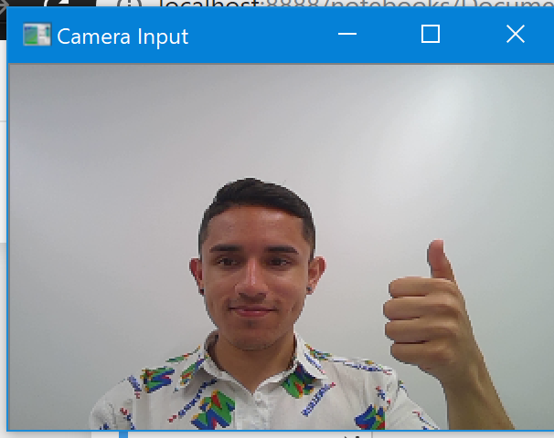
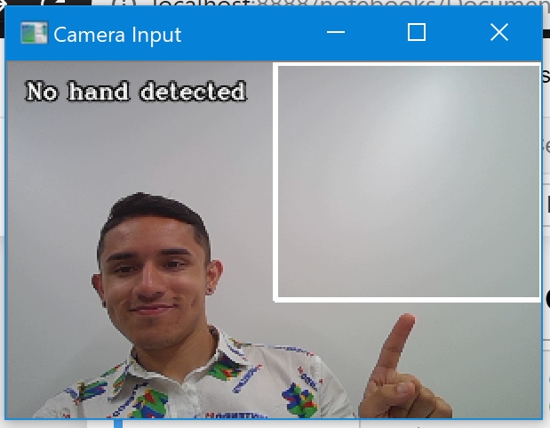
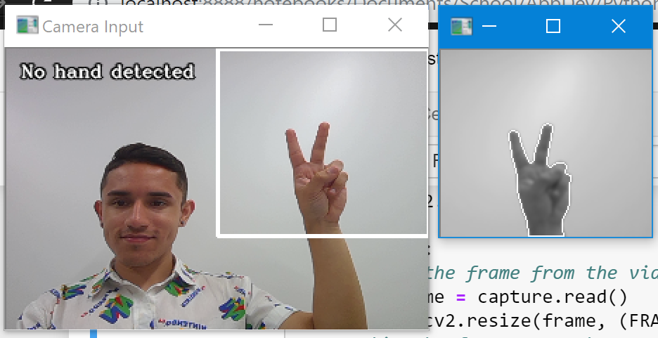
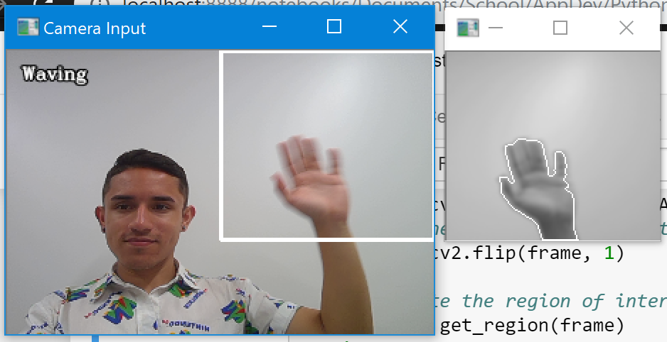
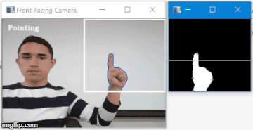
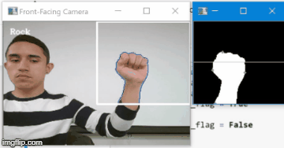
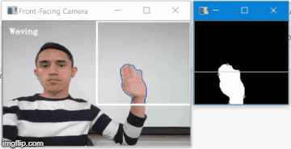

# Hand gesture recognition in Python using OpenCV

This guide will teach you how to code a computer vision program that recognizes simple hand gestures:
- Waving
- Pointing (one finger extended)
- Scissors (two fingers extended)
- Rock (no fingers extended)

The easiest way to get this running is to use a Jupyter Notebook, which allows you to write your Python 
code in modules and run each individually or as a group.  

## Table of Contents
- [Objective 0: Get acquainted and plan ahead](#Objective-0:-Get-acquainted-and-plan-ahead)
- [Objective 1: Write the base for the program](#Objective-1:-Write-the-base-for-the-program)
  - [Step 1a: Import libraries and create global variables](#Step-1a:-Import-libraries-and-create-global-variables)
  - [Step 1b: Write a loop to get camera input](#Step-1b:-Write-a-loop-to-get-camera-input)
  - [Step 1c: Set up variables for image analysis](#Step-1c:-Set-up-variables-for-image-analysis)
- [Objective 2: Create tools for hand data and screen writing](#Objective-2:-Create-tools-for-hand-data-and-screen-writing)
  - [Step 2a: Create an object class to hold hand data](#Step-2a:-Create-an-object-class-to-hold-hand-data)
  - [Step 2b: Create a function that writes hand data on the screen](#Step-2b:-Create-a-function-that-writes-hand-data-on-the-screen)
- [Objective 3: Recognize when a hand is in the region of interest](#Objective-3:-Recognize-when-a-hand-is-in-the-region-of-interest)
  - [Step 3a: Get the background ready for averaging](#Step-3a:-Get-the-background-ready-for-averaging)
  - [Step 3b: Average the first CALIBRATION_TIME background frames](#Step-3b:-Average-the-first-CALIBRATION_TIME-background-frames)
  - [Step 3c: Use differencing to isolate a hand from the background](#Step-3c:-Use-differencing-to-isolate-a-hand-from-the-background)
- [Objective 4: Recognize when the user waves](#Objective-4:-Recognize-when-the-user-waves)
  - [Step 4a: Program the system to get the hand's center point](#Step-4a:-Program-the-system-to-get-the-hand's-center-point)
  - [Step 4b: Create a function for handData to check for waving](#Step-4b:-Create-a-function-for-handData-to-check-for-waving)
- [Objective 5: Count fingers](#Objective-5:-Count-fingers)
  - [Step 5a: Create a function to count fingers crudely](#Step-5a:-Create-a-function-to-count-fingers-crudely)
  - [Step 5b: Create a list of gestures to choose the most frequent one](#Step-5b:-Create-a-list-of-gestures-to-choose-the-most-frequent-one)  

## Objective 0: Get acquainted and plan ahead
Before we do any coding, it's important to think of how we want to approach the task, especially 
because there are multiple ways to code a computer vision program like this one.  

To focus on the user's hand, we can use [background subtraction in OpenCV](https://docs.opencv.org/3.4/d1/dc5/tutorial_background_subtraction.html): basically, we first take a snapshot of the user's background, then we compare all subsequent 
frames to the snapshot and check the difference. Using thresholding, we can highlight the difference between the two images 
to find the object of interest (in this case, the user's hand).  

To make the thresholding easier, we can also focus on only a portion of the window, which will help with both user comfort 
(they won't have to stay off-screen to use the program) and runtime (since less pixels will be checked for gestures).  

For recognizing gestures, I found the simplest strategy is to have a "gesture recognizer" with two outputs of different priority:  
- one that checks how much the center of the hand is moving and how quickly, to check for waving (high priority)  
- one that counts the number of fingers extended, then selects the gesture based on the number (low priority)  

The priority aspect is important since, if the user's hand is waving quickly, we shouldn't waste time trying to 
count the number of fingers extended (especially since they'll likely be too blurry to count reliably anyway).  
  
## Objective 1: Write the base for the program  

First things first: we have to lay out the structure for our program and create the tools that we'll use later on. 
For example, we know we're gonna hold the background as a variable, and we could make holding hand data easier by 
storing it in variables contained inside an object.  We also have to import the libraries we're going to use, too!  

### Step 1a: Import libraries and create global variables  
Let's get started! We first have to import the Numpy and OpenCV libraries.  
We also want to declare some global variables that'll be used between multiple functions, such as 
the background, calibration settings, and more.   

```python
import numpy as np
import cv2

# Hold the background frame for background subtraction.
background = None
# Hold the hand's data so all its details are in one place.
hand = None
# Variables to count how many frames have passed and to set the size of the window.
frames_elapsed = 0
FRAME_HEIGHT = 200
FRAME_WIDTH = 300
# Humans come in a ton of beautiful shades and colors.
# Try editing these if your program has trouble recognizing your skin tone.
CALIBRATION_TIME = 30
BG_WEIGHT = 0.5
OBJ_THRESHOLD = 18
```

### Step 1b: Write a loop to get camera input  
Before we can get into the background subtraction, thresholding, and more, we have to write code 
so that the camera can actually take input for processing.  

Create a new cell for the main function. To get input from your system's camera, we use cv2's VideoCapture function.  
(Note: If it ends up using the wrong camera, try replacing 0 with 1, 2, etc. For me, my self-facing camera is 1)  
```python
capture = cv2.VideoCapture(0)
```

And then write a loop immediately after it to actually read frames from the camera constantly, until the user presses x to exit:  
```python
while (True):
    # Store the frame from the video capture and resize it to the desired window size.
    ret, frame = capture.read()
    frame = cv2.resize(frame, (FRAME_WIDTH, FRAME_HEIGHT))

    cv2.imshow("Camera Input", frame)
    # Check if user wants to exit.
    if (cv2.waitKey(1) & 0xFF == ord('x')):
        break

# When we exit the loop, we have to stop the capture too.
capture.release()
cv2.destroyAllWindows()
```

Great, now our program can take input from the camera! But you might notice it doesn't work like a mirror, which 
makes it confusing to use. Let's add these 2 lines right after the line beginning with `frame = `:  

```python
    # Flip the frame over the vertical axis so that it works like a mirror, which is more intuitive to the user.
    frame = cv2.flip(frame, 1)
```  

Your program should now work like a mirror. Perfect!  

### Step 1c: Set up variables for image analysis  

The last step is just to set up the region of interest's bounds and initialize frames_elapsed. 
Within the main function, before even taking the capture of the screen, type this:  

```python
# Our region of interest will be the top right part of the frame.
region_top = 0
region_bottom = int(2 * FRAME_HEIGHT / 3)
region_left = int(FRAME_WIDTH / 2)
region_right = FRAME_WIDTH

frames_elapsed = 0
```
##### (Note: 0,0 is the top left pixel of the frame, and values increase as we move away from that corner.)

and increment frames_elapsed after showing the image (i.e., calling `cv2.imshow()`):  

```python
frames_elapsed += 1
```

So now we have a program that will take input from the camera and return the frames with 
a square drawn where the user should put their hand. Check out [checkpoint 1 to make sure you've got it right](checkpoint1.ipynb).  

  
  
  
  
## Objective 2: Create tools for hand data and screen writing  

Now that we have our base input code working, let's continue building our foundation. Before we 
jump into coding the background differencing, finger counting, etc. let's start organized so we 
don't have to clean up a ton later.  

It would be disorganized to have a bunch of global variables for all the data of the hand, so we'll 
create an object class to hold all that data and update it. It would also be useless to have our 
gesture recognition functions coded without being able to print the results to the screen, so let's 
do that too.  

### Step 2a: Create an object class to hold hand data  

First, create a new cell in the Jupyter notebook. Then code a new object class, HandData, with the 
following variables and constructor:  

```python
class HandData:
    top = (0,0)
    bottom = (0,0)
    left = (0,0)
    right = (0,0)
    centerX = 0
    prevCenterX = 0
    isInFrame = False
    isWaving = False
    fingers = 0
    
    def __init__(self, top, bottom, left, right, centerX):
        self.top = top
        self.bottom = bottom
        self.left = left
        self.right = right
        self.centerX = centerX
        self.prevCenterX = 0
        isInFrame = False
        isWaving = False
```  

We'll also want an `update()` function that does the same as above without creating a new object.  

```python
    def update(self, top, bottom, left, right):
        self.top = top
        self.bottom = bottom
        self.left = left
        self.right = right
```  

(You might notice that we don't update the variables related to the center of the hand nor finger count; 
we'll do that later when we code to detect hand waving and finger count recognition.)  

### Step 2b: Create a function that writes hand data on the screen  

We want to tell the user if the background is being calibrated, if the hand isn't in the frame, 
how many fingers they're holding up, etc. so let's create a helper function to do exactly that.  

What are the things we need it to say?  
- "Calibrating..." if less than `CALIBRATION_TIME` frames have elapsed since starting the program
- "Hand not found" if a hand isn't in the region of interest
- "Waving" if the user is waving their hand
- The name of the gesture if they're holding fingers up  

So let's create a new cell in the notebook and write the function we need:  

```python
# Here we take the current frame, the number of frames elapsed, and how many fingers we've detected
# so we can print on the screen which gesture is happening (or if the camera is calibrating).
def write_on_image(frame, hand):
    text = "Searching..."

    if frames_elapsed < CALIBRATION_TIME:
        text = "Calibrating..."
    elif hand == None or hand.isInFrame == False:
        text = "No hand detected"
    else:
        if hand.isWaving:
            text = "Waving"
        elif hand.fingers == 0:
            text = "Rock"
        elif hand.fingers == 1:
            text = "Pointing"
        elif hand.fingers == 2:
            text = "Scissors"
    
    cv2.putText(frame, text, (10,20), cv2.FONT_HERSHEY_COMPLEX, 0.4,( 0 , 0 , 0 ),2,cv2.LINE_AA)
    cv2.putText(frame, text, (10,20), cv2.FONT_HERSHEY_COMPLEX, 0.4,(255,255,255),1,cv2.LINE_AA)

    # Highlight the region of interest using a drawn rectangle.
    cv2.rectangle(display_frame, (region_left, region_top), (region_right, region_bottom), (255,255,255), 2)
```

Then, add the helper function to the main function so it can be called, just before the line with `cv2.imshow()`:    

```python
    # Write the action the hand is doing on the screen, and draw the region of interest.
    write_on_image(frame, hand)
```

Now the application will be more neatly organized later on (less headaches!) and we can check the 
status of the gesture recognizer using the write_on_image function.  

You should now have your input feed from before, but with a message that says "Calibrating..." at 
first and then "No hand detected". You can check that [your code matches with checkpoint 2](checkpoint2.ipynb).  

  
  
  
  
## Objective 3: Recognize when a hand is in the region of interest  

Let's use the background differencing concept from before to notice when a hand is in the region 
of interest. We need a background that we save at the beginning for the first CALIBRATION_TIME frames 
after running the application, along with a function that can separate the background from subsequent frames.  

### Step 3a: Get the background ready for averaging  

If you're totally new to computer vision, there's value in [reading about edge detection as a principle](https://www.mathworks.com/discovery/edge-detection.html) -- it explains some of the practices we're about to implement. But if you want 
the summarized notes, here they are:  
- Edge detection is easiest by noting sudden differences in brightness/lighting  
- As a result, it's best to convert the frame into a black & white image before processing it  
- To avoid stray pixels (image noise) being labeled as edges, we can smoothen the image with a Gaussian blur  

So let's grab the background and pass it into a function that crops only the area of interest, 
turns it gray, smoothens it a bit. This way we can use it both for averaging and for segmenting later.

Create a new cell in the notebook and let's write the function `get_region()`:  

```python
def get_region(frame):
    # Separate the region of interest from the rest of the frame.
    region = frame[region_top:region_bottom, region_left:region_right]
    # Make it grayscale so we can detect the edges more easily.
    region = cv2.cvtColor(region, cv2.COLOR_BGR2GRAY)
    # Use a Gaussian blur to prevent frame noise from being labeled as an edge.
    region = cv2.GaussianBlur(region, (5,5), 0)

    return region
```  

Then, in the main function, after flipping the frame using `cv2.flip()`, call `get_region()` and save the result:  

```python
    # Separate the region of interest and prep it for edge detection.
    region = get_region(frame)
```  

### Step 3b: Average the first CALIBRATION_TIME background frames  

Now that we can crop the region of interest, let's write a new function to get the averages of them. 
Create a new cell and write this function:  

```python
def get_average(region):
    # We have to use the global keyword because we want to edit the global variable.
    global background
    # If we haven't captured the background yet, make the current region the background.
    if background is None:
        background = region.copy().astype("float")
        return
    # Otherwise, add this captured frame to the average of the backgrounds.
    cv2.accumulateWeighted(region, background, BG_WEIGHT)
```

If we only take the first frame of background, we'll immediately run into issues due to lighting 
changes. If your webcam is anything like mine, it spends its first several frames adjusting for 
shadows, which is not what we want for our program.  

Remember our `frames_elapsed` and `CALIBRATION_TIME` variables from before? This is where they come in handy! 
I've found that averaging the first ~30 frames of camera input is enough to overcome that obstacle of initial 
lighting adjustments.  

So let's go to the main function and, immediately after we get the region of interest using `get_region()`,
write an if statement that checks if we've passed our calibration time:  

```python
    if frames_elapsed < CALIBRATION_TIME:
        get_average(region)
```

### Step 3c: Use differencing to isolate a hand from the background  

Next, we have to write a function to segment the image and mark which parts of the region of interest 
are covered by a hand.

To segment the image properly, we have to follow these steps:
- Get the absolute difference between the current frame and the previous averages of the background.
- Threshold that difference, so the results are binary: either it's part of the background, or it isn't.
- Get the [contours](https://datacarpentry.org/image-processing/09-contours/) of the shape we thresholded. OpenCV will do this for us and return an outline of the shape.

Create a new cell in the Jupyter notebook and create the function `segment()`:  

```python
# Here we use differencing to separate the background from the object of interest.
def segment(region):
    global hand
    # Find the absolute difference between the background and the current frame.
    diff = cv2.absdiff(background.astype(np.uint8), region)

    # Threshold that region with a strict 0 or 1 ruling so only the foreground remains.
    thresholded_region = cv2.threshold(diff, OBJ_THRESHOLD, 255, cv2.THRESH_BINARY)[1]

    # Get the contours of the region, which will return an outline of the hand.
    (_, contours, _) = cv2.findContours(thresholded_region.copy(), cv2.RETR_EXTERNAL, cv2.CHAIN_APPROX_SIMPLE)

    # If we didn't get anything, there's no hand.
    if len(contours) == 0:
        if hand is not None:
            hand.isInFrame = False
        return
    # Otherwise return a tuple of the filled hand (thresholded_region), along with the outline (segmented_region).
    else:
        if hand is not None:
            hand.isInFrame = True
        segmented_region = max(contours, key = cv2.contourArea)
        return (thresholded_region, segmented_region)
```  

After we've gotten the average of the first `CALIBRATION_TIME` frames, we can segment region of interest. 
And just to test that they're working, we can also add a line that draws the segmented region!  

Add these lines to the previous if statement that calls `get_average()`:  

```python
    if frames_elapsed < CALIBRATION_TIME:
        get_average(region)
    else:
        region_pair = segment(region)
        if region_pair is not None:
            # If we have the regions segmented successfully, show them in another window for the user.
            (thresholded_region, segmented_region) = region_pair
            cv2.drawContours(region, [segmented_region], -1, (255, 255, 255))
            cv2.imshow("Segmented Image", region)
```  

So now your code should segment in the region of interest. You can [check how your code matches up here](checkpoint3.ipynb).  

We've made great headway; let's keep up the momentum!  

  
  
  
  
## Objective 4: Recognize when the user waves  

The first gesture we can get our program to recognize is waving -- it's easier than counting 
fingers and also has higher priority compared to deciphering finger-based gestures.  

How do we do that? Now that we have the image segmentation function, we can get an isolated image
of the hand. We take that isolated hand shape and find its highest and lowest x and y values so 
we can find the center, and if the center point is moving a lot in a short amount of time, the 
user is waving!  

### Step 4a: Program the system to get the hand's center point  

To reduce the amount of math we have to do, we can first create a [convex hull](https://www.pyimagesearch.com/2016/04/11/finding-extreme-points-in-contours-with-opencv/) of the segmented image. 
That'll "crop" the image so just the hand is there, not the hand + empty space surrounding it.  

The left side of the hand is the lowest x value equal to 1 in the segmented image, while the right 
side is the highest, the top is the lowest y value, and the bottom is the highest.  

Let's create a new function that gets the hand's dimensions, center, etc. so we can use this info 
both for detecting waving and for counting fingers later on.  

```python
def get_hand_data(thresholded_image, segmented_image):
    # Enclose the area around the extremities in a convex hull to connect all outcroppings.
    convexHull = cv2.convexHull(segmented_image)
    
    # Find the extremities for the convex hull and store them as points.
    top    = tuple(convexHull[convexHull[:, :, 1].argmin()][0])
    bottom = tuple(convexHull[convexHull[:, :, 1].argmax()][0])
    left   = tuple(convexHull[convexHull[:, :, 0].argmin()][0])
    right  = tuple(convexHull[convexHull[:, :, 0].argmax()][0])
    
    # Get the center of the palm, so we can check for waving and find the fingers.
    centerX = int((left[0] + right[0]) / 2)
```  

We will call the constructor if the object is null, and update its data if it already exists:  

```python
    # We put all the info into an object for handy extraction (get it? HANDy?)
    if hand == None:
        hand = HandData(top, bottom, left, right, centerX)
    else:
        hand.update(top, bottom, left, right)
```  

### Step 4b: Create a function for handData to check for waving  

It would be difficult to check for waving every frame, as that would require the user to wave 
their hand VERY quickly over a large area every single frame. Instead, let's check every eigth 
frame to see if the center of the user hand has moved significantly, since that would be a better 
indicator of waving.  

In the `get_hand_data()` function we just created, append this:  

```python
    if frames_elapsed % 8 == 0:
        handData.checkForWaving(centerX)
```  

Next, within the Hand class itself from way before, create the function `check_for_waving()`. 
It'll update the current `centerX` and `prevCenterX` of the hand, then check if they differ 
enough to signify waving. The boolean flag within the hand object will automatically switch on 
the "Waving" action in `write_on_image()` from before!

```python
    def check_for_waving(self, centerX):
        self.prevCenterX = self.centerX
        self.centerX = centerX
        
        if abs(handData.centerX - handData.prevCenterX > 3):
            handData.isWaving = True
        else:
            handData.isWaving = False
```  

And finally, add the `get_hand_data()` call to the main function after calling `cv2.imshow()` on the segmented image:  

```python
            # If we have the regions segmented successfully, show them in another window for the user.
            (thresholded_region, segmented_region) = region_pair
            cv2.drawContours(region, [segmented_region], -1, (255, 255, 255))
            cv2.imshow("Segmented Image", region)
            
            get_hand_data(thresholded_region, segmented_region)
```

If all has gone according to plan, your program should now recognize waving! If you're having issues, 
try [referencing the checkpoint4 Jupyter Notebook](checkpoint4.ipynb).  

  
  


## Objective 5: Count fingers  

Now it's time to finish our project by creating the functions that count fingers. We'll use the 
system described before of drawing a line below the finger tops and counting the number of 
intersections we make.  

### Step 5a: Create a function to count fingers crudely  

Now it's time to complete our last goal: recognizing gestures that involve counting the number of 
extended fingers. What's the easiest way to do this? 
1. Draw a line across object but just beneath the top
2. Move across from left to right, noting the number of times we intersect the object
    - Count the number of shapes separated by gaps, these are likely fingers
    - If a shape is particularly large and there's only one, we're likely looking at a fist
3. Update `hand.fingers` variable so `write_on_image()` can display the right result  

So let's get started by creating a new function, `count_fingers()`, in its own cell:  

```python
def count_fingers(thresholded_image):
    
    # Find the height at which we will draw the line to count fingers.
    line_height = int(hand.top[1] + (0.2 * (hand.bottom[1] - hand.top[1])))
    
    # Get the linear region of interest along where the fingers would be.
    line = np.zeros(thresholded_image.shape[:2], dtype=int)
    
    # Draw a line across this region of interest.
    cv2.line(line, (thresholded_image.shape[1], line_height), (0, line_height), 255, 1)
    
    # Do a bitwise AND to find where the line intersected the hand -- this is where the fingers are!
    line = cv2.bitwise_and(thresholded_image, thresholded_image, mask = line.astype(np.uint8))
    
    # Get the line's new contours. The contours are basically just little lines formed by gaps 
    # in the big line across the fingers, so each would be a finger unless it's very wide.
    (_, contours, _) = cv2.findContours(line.copy(), cv2.RETR_EXTERNAL, cv2.CHAIN_APPROX_NONE)
    
    fingers = 0
    
    # Count the fingers by making sure the contour lines are "finger-sized", i.e. not too wide.
    # This prevents a "rock" gesture from being mistaken for a finger.
    for curr in contours:
        width = len(curr)
        
        if width < 3 * abs(hand.right[0] - hand.left[0]) / 4 and width > 5:
            fingers += 1
    
    return fingers
```  

Then, update `get_hand_data()` to call the new function on every frame by appending this:  

```python
hand.fingers = count_fingers(thresholded_image)
```

Great! Now our program automatically outputs the current gesture based on what's going on in the 
current frame. But you might notice it can be erratic, quickly switching from gesture to gesture. 
So let's make it smarter by creating a list of observed gestures, then make it choose the most 
common of all the gestures.  

### Step 5b: Create a list of gestures to choose the most frequent one  

Let's create a new cell and make a basic function for finding the most frequent entry in a list:  

```python
def most_frequent(input_list):
    dict = {}
    count = 0
    most_freq = 0
    
    for item in reversed(input_list):
        dict[item] = dict.get(item, 0) + 1
        if dict[item] >= count :
            count, most_freq = dict[item], item
    
    return most_freq
```
##### (This is the last function we create... hooray!)  

Then, create the list inside the `HandData` class with its other variables:  

```python
gesture_list = []
```  

And finally, edit the function call inside `get_hand_data()` so that it appends to `hand.gestureList` and  
chooses the most frequent after 12 frames, then clears the list:  

```python
    # We count the number of fingers up every frame, but only change hand.fingers if
    # 12 frames have passed, to prevent erratic gesture counts.
    hand.gestureList.append(count_fingers(thresholded_image))
    if frames_elapsed % 12 == 0:
        hand.fingers = most_frequent(hand.gestureList)
        hand.gestureList.clear()
```  

And that's it! You're finished creating a program to recognize gestures using the OpenCV library 
in Python. Congrats! (If you have any hiccups with the code, [reference checkpoint5](checkpoint5.ipynb))  

| Pointing                        | Scissors                        | Rock                    | Waving                      |
|:------------------------------: |:------------------------------: | :---------------------: | :-------------------------: |
|  |  |  |  |  
  
